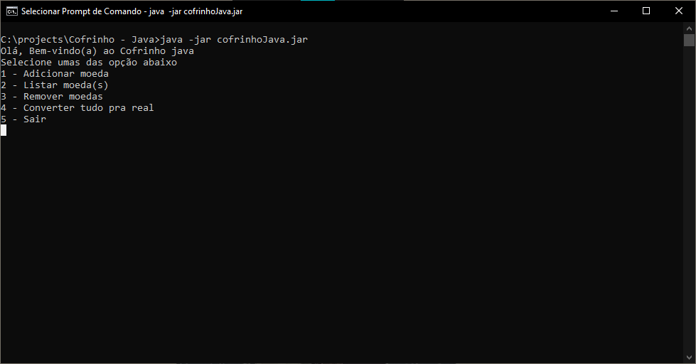

<h1 align="center">Cofrinho - Java</h1>
<h3 align="center">Projeto realizado pra realização do trabalho da diciplina Orientação a Objeto.</h3>
<h4>Executando o projeto</h4>

Tudo que precisa pra executar esse projeto, e baixar esse repositorio, e pelo terminal dentro da pasta do o comando

<strong>java -jar cofrinhoJava.jar</strong>

