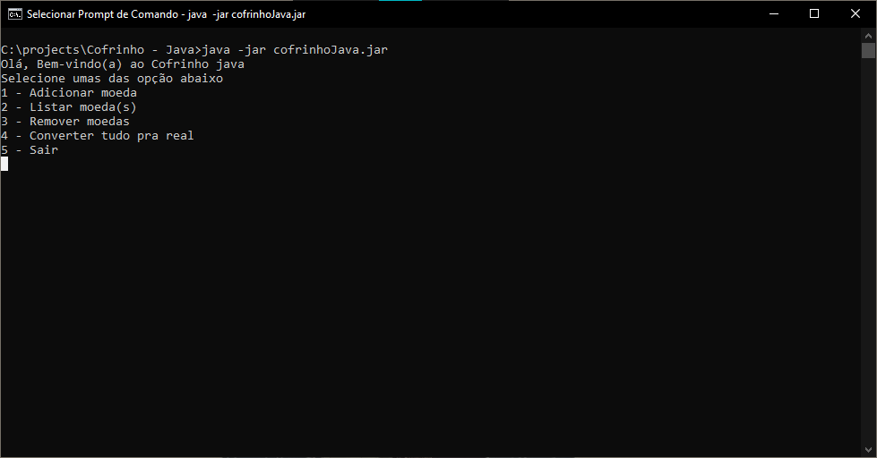

Aqui vai uma versão bem mais organizada e profissional do seu README, mantendo simples mas com cara de projeto bem feito 👇

---

# 💰 Cofrinho - Java

<p align="center">
  Projeto desenvolvido para a disciplina de <strong>Orientação a Objetos</strong>.
</p>

---

## 📌 Sobre o projeto

O **Cofrinho - Java** é uma aplicação simples desenvolvida com foco nos conceitos de Programação Orientada a Objetos (POO), como:

* Encapsulamento
* Herança
* Polimorfismo
* Abstração

O sistema simula um **cofrinho**, permitindo armazenar diferentes tipos de moedas e realizar operações básicas.

---

## ⚙️ Funcionalidades

* 💵 Adicionar moedas
* 📊 Listar valores armazenados
* 💱 Converter valores (se aplicável no projeto)
* 🧮 Calcular total acumulado

---

## 🚀 Como executar

Para rodar o projeto, siga os passos abaixo:

1. Baixe ou clone este repositório:

```bash
git clone <url-do-repositorio>
```

2. Acesse a pasta do projeto:

```bash
cd nome-da-pasta
```

3. Execute o arquivo `.jar`:

```bash
java -jar cofrinhoJava.jar
```

---

## 🖥️ Pré-requisitos

* Java instalado (recomendado Java 8 ou superior)

---

## 📷 Demonstração

<p align="center">
  
</p>

---

## 🎯 Objetivo acadêmico

Este projeto foi desenvolvido com o objetivo de praticar e aplicar os conceitos fundamentais de **Programação Orientada a Objetos**, sendo parte das atividades da disciplina.

---

## 📌 Observações

* Projeto com fins educacionais
* Código simples e focado no aprendizado

---
